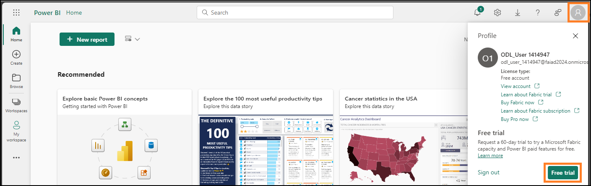

# Lab 1 — Getting Started with Fabric Notebooks (1 Hour)

This lab focuses on initial setup and validation of the Microsoft Fabric
environment used throughout the series.

Key activities include:
- Enabling a Microsoft Fabric trial license

- Creating a Fabric workspace
- Creating and connecting a Lakehouse
- Importing notebooks
- Authenticating Esri GeoAnalytics
- Loading and visualizing U.S. state boundary data

> Follow the CloudLabs lab guide for all execution steps and validation.
